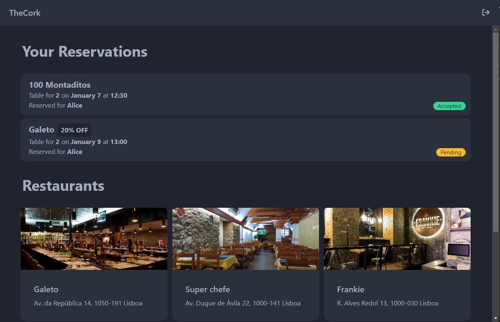
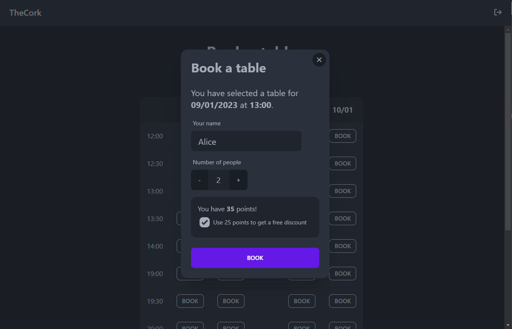
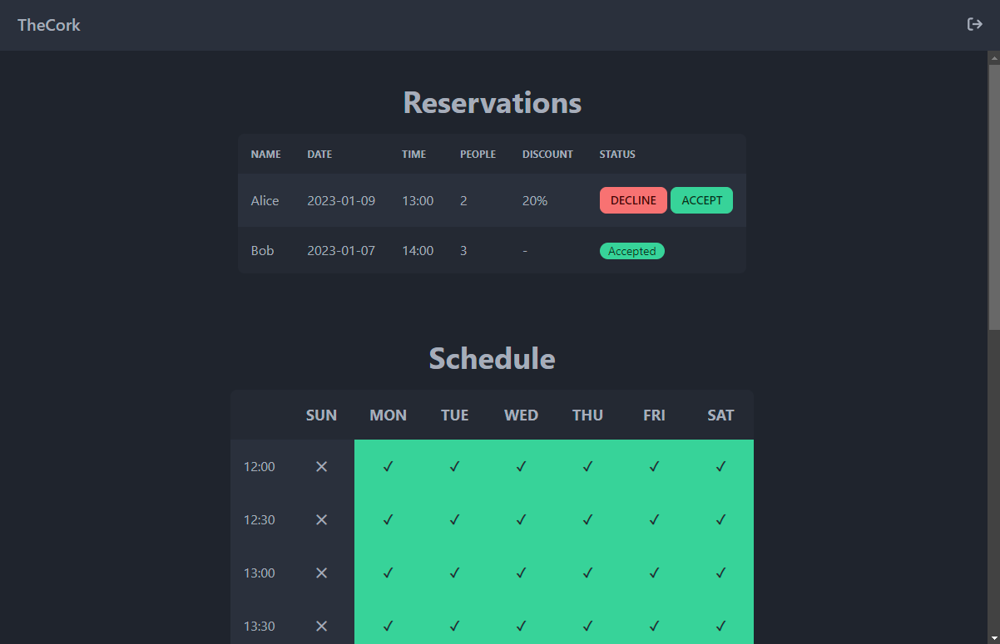

# The Cork - Group 25

## Context

This project was built in the context of the Network and Computer Security course at IST.

## Introduction

TheCork is a service that allows its users to make restaurant reservations via a mobile application and website that integrates seamlessly with the restaurants' calendars.

Customers can see which restaurants are available and book a table in a mobile app. They can also do these commands on a website. 
Restaurants also have a platform where they can manage their schedule and approve or deny clients’ reservations. 

The system also has a discount card service provider, that allows customers to use their card points in order to have discounts in their bookings.

## General Information

This section expands on the introductory paragraph to give readers a better understanding of your project. 
Include a brief description and answer the question, "what problem does this project solve?"

### Built With

For this project we used the following technologies:

* [Node.js](https://nodejs.org/en/about/) - Backend Servers and API
* [npm](https://www.npmjs.com/package/npm) - Package manager
* [MongoDB](https://www.mongodb.com/docs/) - Databases
* [SvelteKit](https://kit.svelte.dev/docs/introduction) - Frontend

## Getting Started

These instructions will get you a copy of the project up and running on your local machine for development and testing purposes. See deployment for notes on how to deploy the project on a live system.

### Prerequisites

[VirtualBox](https://www.virtualbox.org/wiki/Downloads)

### Installing

Follow the [installation guide](InstallationGuide.md)

## Demo

The home page of the platform contains the users' reservations and the available restaurants sorted by distance.

If a user selects a restaurant, they can check out the avalability schedule and make a reservation on an available time slot. With each reservation, users earn points which they can trade for restaurant discounts associated with the reservation.

There is aditionally a backoffice page available to users with the role of `admin` where it is possible to update the schedule, as well as the upcoming reservations, which they can choose to accept or decline.

## Deployment

If you are deploying to a live system (e.g. a host or a cloud provider), you should follow the [installation guide](InstallationGuide.md) ignoring the steps related to virtual machines.

The provided SSL certificates are self-signed and are only meant for a development environment. In production, they should be replaced with new certificates, signed by a trusted CA.

Additionally, all the endpoints need to be replaced in the `.env` files, along with the secret tokens.

Furthermore, if the databases were to be deployed on separate machines, SSL should be enabled in the configuration in order to ensure secure communication.

## Additional Information

### Authors

* **André Romão** - [andreromao](https://github.com/andreromao)
* **Maria Albino** - [mariacasanova25](https://github.com/mariacasanova25)
* **Rodrigo Palmeirim** - [rodrigohpalmeirim](https://github.com/rodrigohpalmeirim)

